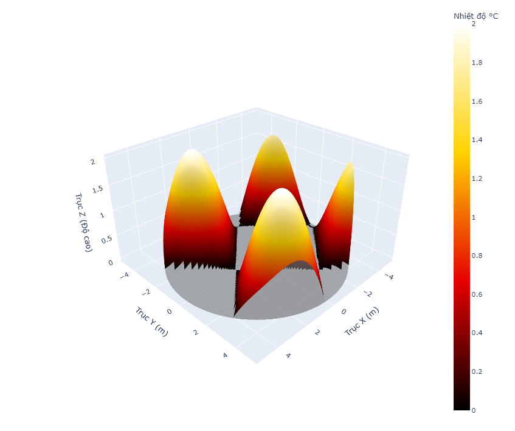
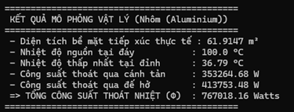
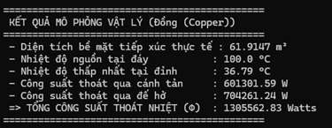
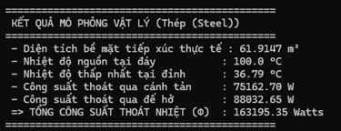

# BTL_GT2_NHOM35_HK252

> Source code của BTL môn Giải tích 2 (MT1005), trường Đại học Bách Khoa - Đại học Quốc gia TP.Hồ Chí Minh

# Đề bài

Trong thiết kế vi mạch và các thiết bị viễn thông công suất cao, việc tản nhiệt là yếu tố sống còn để đảm bảo tuổi thọ linh kiện. Một kỹ sư cần tìm kiếm một vật liệu phù hợp để thiết kế một miếng tản nhiệt (*Heat Sink*) có mặt trên được mô hình hóa bởi một mặt cong **S**.  

## Điều kiện của miếng tản nhiệt

- **Miền đáy (D):**  
  Là một hình tròn nằm trên mặt phẳng Oxy, có tâm tại gốc tọa độ O(0, 0) và bán kính R (mét).

- **Mặt trên (S):**  
  Được xác định bởi phương trình:  
  $$
  z = f(x, y), \quad z \geq 0
  $$  
  Tại những vùng mà \(f(x, y) < 0\), linh kiện được coi là để hở bề mặt bo mạch phẳng (\(z = 0\)).

- **Trường nhiệt độ (T):**  
  Nhiệt độ trong vật liệu giảm dần theo độ cao \(z\) theo quy luật hàm mũ:  
  $$
  T(z) = T_{\text{base}} \cdot e^{-\alpha z}
  $$  
  với \(T_{\text{base}}\) là nhiệt độ nguồn nhiệt tại đáy và \(\alpha\) là hệ số suy giảm nhiệt.

- **Vector dòng nhiệt (q):**  
  Tuân theo Định luật Fourier:  
  $$
  q = -k \nabla T
  $$  
  với \(k\) là độ dẫn nhiệt của vật liệu (Nhôm, Đồng hoặc Thép).

# Điều kiện thực nghiệm

- Hàm mặt trên: $z = sin(x) - cos(y)$
- R = 5
- Nhiệt độ mặt đáy: $100^\circ C$

# Kết quả thực nghiệm

